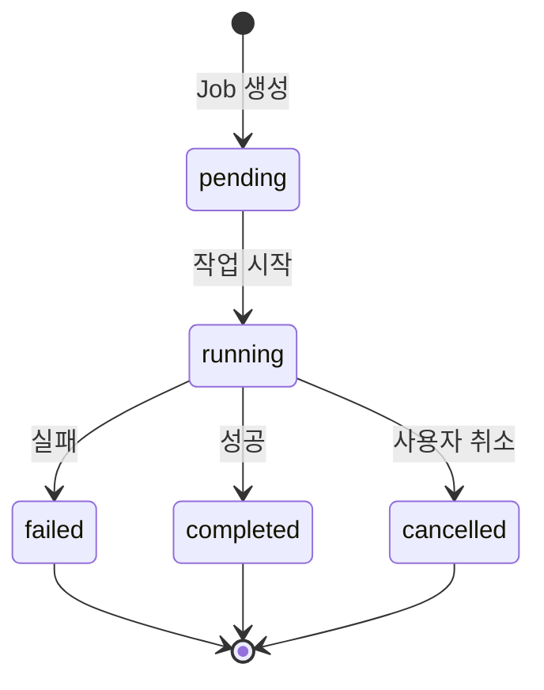
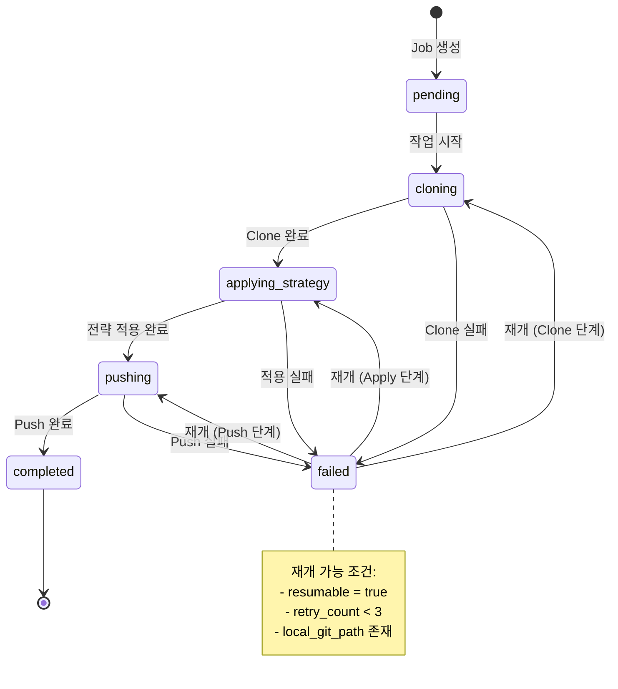
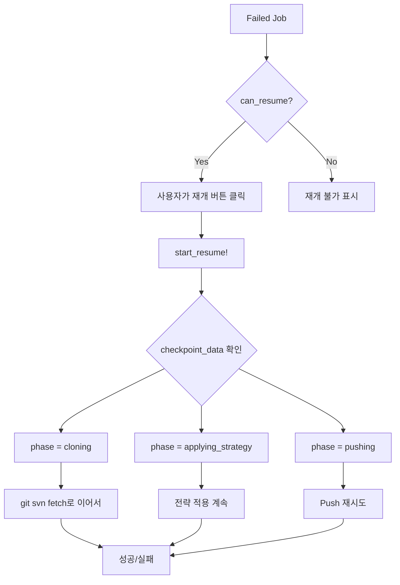

# Job 상태 전이 다이어그램

## 1. 기존 상태 (status)



## 2. 새로운 단계 (phase) - 재개 가능



## 3. 재개 가능한 오류 vs 치명적 오류

### 재개 가능한 오류 (resumable = true)
- 네트워크 연결 오류
- 타임아웃
- 일시적인 GitLab API 오류
- 디스크 공간 부족

### 치명적 오류 (resumable = false)
- SVN 인증 실패
- 저장소 접근 권한 없음
- Git 저장소 손상
- 잘못된 SVN URL

## 4. 체크포인트 데이터 구조

```json
{
  "timestamp": "2025-08-05T10:30:00Z",
  "phase": "cloning",
  "phase_details": {
    "start_time": "2025-08-05T10:00:00Z",
    "last_activity": "2025-08-05T10:29:30Z",
    "progress_percentage": 45
  },
  "git_path": "/app/git_repos/12/git_repo",
  "last_revision": 3500,
  "additional_data": {
    "total_estimated_revisions": 7500,
    "processing_speed": 2.5,
    "error_count": 0
  }
}
```

## 5. 재개 플로우



## 6. 구현 시 고려사항

1. **체크포인트 저장 시점**
   - 각 단계 시작 시
   - 주기적으로 (5분마다)
   - 중요한 진행 시점 (예: 1000 커밋마다)

2. **재개 시 검증**
   - Git 저장소 무결성 확인
   - SVN 저장소 접근 가능 여부
   - 마지막 성공한 리비전 확인

3. **사용자 피드백**
   - 재개 가능 여부 명확히 표시
   - 재개 진행률 표시
   - 실패 시 이유 설명